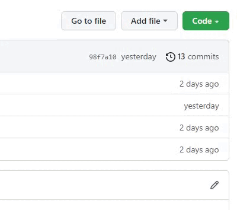

# Introduction

[Confirmed](https://github.com/caodoc/CIANS/tree/main/Confirmed): Can run full tests, return max points. </br>
[.docs](https://github.com/caodoc/CIANS/tree/main/.docs): Documents


# Download

<strong> How to download manually: </strong> </br>
 </br>
And then uncompress it.

<strong> Download using git: </strong> </br>
Copy this and paste to git window: </br>
``` 
git clone https://github.com/caodoc/CIANS.git
```
</br>

After it finished, check: </br>
```
%userprofile%
```
</br>


# Contact

<strong> Facebook </strong>: [Cao](https://www.facebook.com/caodoc/) </br>
<strong> Discord </strong>: Ducca#3106 </br> 


